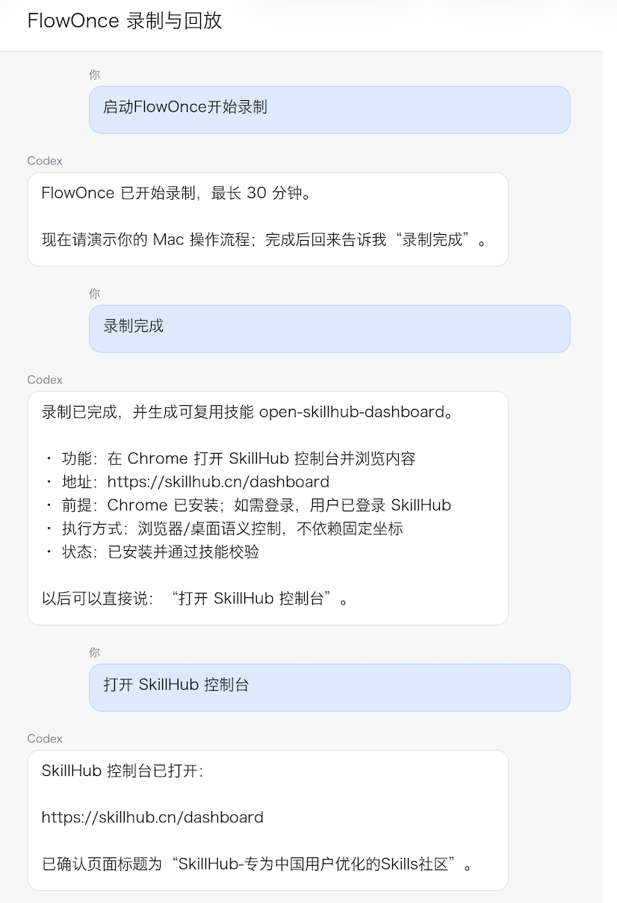

# 常见问题 (FAQ)

## 安装与权限

### Q: 安装后 AI 说找不到录制工具？

确保已完成以下步骤：
1. 双击 DMG 中的 **Install FlowOnce.app** 完成安装
2. 在 **系统设置 → 隐私与安全性 → 辅助功能** 中添加并启用 `~/Applications/FlowOnce.app`
3. **完全退出并重新打开** AI 主机（CodeBuddy / WorkBuddy / Qoder / QoderWork / Codex）

如果权限已开启但仍不工作，尝试**先关闭再重新开启**辅助功能开关，让 macOS 刷新授权记录。

### Q: macOS 提示"无法验证开发者"或"不能打开"？

本地构建的 DMG 使用 ad-hoc 签名，仅限开发测试。正式分发需要 Apple Developer ID 签名和公证。请不要关闭 macOS 安全保护，向提供方索取已签名公证的正式版本。

### Q: 支持 Windows 或 Linux 吗？

目前仅支持 **macOS**。录制引擎依赖 macOS Accessibility API 进行语义事件捕获，这是系统级依赖，无法跨平台移植。

### Q: 安装时需要管理员密码吗？

不需要。安装器在当前用户目录下部署所有组件，无需 `sudo` 或系统级管理员权限。

---

## 录制使用

### Q: 录制时 AI 能看到我的屏幕内容吗？

FlowOnce 通过 Accessibility API 捕获**语义事件**（点击了什么按钮、输入了什么文字），而非屏幕截图或录屏。原始事件流是本地 JSONL 文件，不上传任何云端。

### Q: 密码、验证码等敏感信息会被记录吗？

敏感值在编译阶段会被强制替换为占位符（如 `sensitive_input_1`），**物理上无法写入**生成的技能包。但建议录制时尽量避免在敏感页面操作。

### Q: 单次录制最长多久？

**30 分钟**。达到上限会自动停止。点击悬浮窗的 **Cancel** 会丢弃录制，不留痕迹。

### Q: 录制中途出错了怎么办？

当前版本不支持断点续录。如果录制中途出错：
1. 点击悬浮窗 **Stop**（保留录制）或 **Cancel**（丢弃录制）
2. 如果保留了录制，AI 会尝试分析已有事件
3. 如果丢弃了，重新开始一次新的录制即可

### Q: AI 理解错了我的操作怎么办？

AI 生成技能前会拿着草案找你确认，包括：
- 哪些输入是每次会变的（参数化）
- 做到什么状态算成功（验收标准）
- 哪些误操作需要剔除

**你点头之前，技能不会生成。** 如果草案有误，直接告诉 AI 哪里不对。

### Q: 可以同时录制多个工作流吗？

不可以。同一时间只能有一个活跃录制。如果已有录制在进行，AI 会询问你是使用当前录制还是等待它完成。

---

## 生成与使用

### Q: 生成的技能可以在哪些 AI 主机使用？

| 主机 | 安装方式 |
|------|----------|
| CodeBuddy | 复制到 `~/.codebuddy/skills/<name>/` 或 UI 导入 |
| WorkBuddy | Skills > Add Skill > Upload Skill（.zip 包） |
| Qoder | 复制到 `~/.qoder/skills/<name>/` |
| QoderWork | 复制到 `~/.qoderwork/skills/<name>/` 或 UI 安装 |
| Codex | 设置 → MCP 中启用 `flowonce`，安装器自动注册 |

### Q: 换了 AI 主机，技能需要重新录制吗？

不需要。FlowOnce 的 Workflow IR 是宿主无关的，同一个技能包可以装进不同主机。但回放时需要对应主机具备界面控制能力。

### Q: 生成的技能执行时跑偏了怎么办？

每个关键动作都有自动注入的验证点——如果状态不符合预期，AI 会停下来报告而不是硬着头皮继续。你可以在新对话中告诉 AI 哪里出了问题，它会调整后重试。

### Q: 如何更新已有技能？

重新录制一遍操作流程，AI 会生成新版本的技能覆盖旧版本。或者在新对话中告诉 AI 需要修改已有技能的某个步骤。

---

## Codex 专属

### Q: Codex 安装 FlowOnce 后找不到 MCP 工具？

1. 运行安装器（重复安装不会产生重复配置）
2. 完全退出 Codex 后重新打开
3. 进入 Codex → **设置 → MCP**，确认 `flowonce` 已出现并处于启用状态
4. 如果仍未出现，检查 `~/.codex/mcp.json` 中是否包含 flowonce 的配置项

### Q: Codex 中录制和回放流程和其他主机一样吗？

流程完全一致。"请使用 FlowOnce 学习……"开头即可触发录制，生成技能后用自然语言描述目标和参数即可回放。Codex 通过 MCP 原生支持 FlowOnce，无需额外安装插件。

---

## 维护管理

### Q: 如何升级 FlowOnce 到新版本？

下载最新 DMG 安装包，双击 **Install FlowOnce.app** 即可覆盖安装。已录制的技能和配置文件不会被覆盖。升级后请完全退出并重新打开 AI 主机。

### Q: 如何卸载 FlowOnce？

1. 删除 `~/Applications/FlowOnce.app`
2. （可选）删除录制数据和配置：`rm -rf ~/.flowonce/`
3. （可选）删除各 AI 主机的 MCP 配置中 flowonce 相关条目
4. 在 **系统设置 → 隐私与安全性 → 辅助功能** 中移除 FlowOnce 的权限

### Q: 录制的技能保存在哪里？如何手动删除？

生成的技能会安装在对应 AI 主机的技能目录下：

| 主机 | 技能目录 |
|------|----------|
| CodeBuddy | `~/.codebuddy/skills/<skill-name>/` |
| WorkBuddy | 通过 Skills 面板管理 |
| Qoder | `~/.qoder/skills/<skill-name>/` |
| QoderWork | `~/.qoderwork/skills/<skill-name>/` 或 UI 安装 |
| Codex | 通过设置 → MCP 管理 |

删除对应目录即可移除技能。原始录制事件流保存在 `~/.flowonce/` 下，可随时查看或删除。

---

## 隐私与安全

### Q: 录制的数据存在哪里？

所有原始事件流保存在本地 `~/.flowonce/` 目录下，是标准 JSONL 文件。你可以随时查看或删除。

### Q: AI 主机能访问我的录制数据吗？

只有当 AI 主机主动调用 `event_stream_*` 工具时才能读取事件流。如果你不启动录制，任何 AI 都无法访问。

### Q: 录制涉及删除文件、发消息等操作怎么办？

生成的技能在执行涉及**外部消息、删除、财务操作、系统设置变更**等动作时，必须经过当前 AI 主机的确认策略二次确认。FlowOnce 不会自动执行高危操作。
