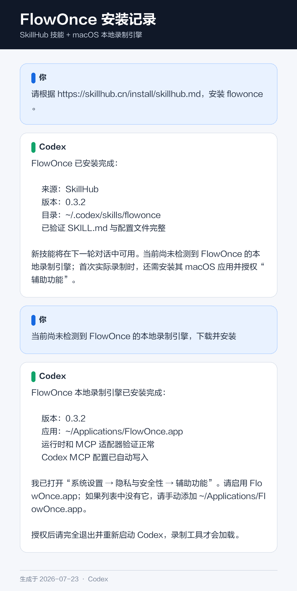

# FlowOnce 普通用户使用手册

**演示一次，随处复用。**

适用于：macOS，以及 CodeBuddy、WorkBuddy、Qoder、QoderWork 或 Codex。

不需要会编程，无需打开终端、选择芯片、配置 MCP 或查找技能文件夹。第一次使用时，FlowOnce 会自动准备本地引擎。免费预览版最多需要您按 macOS 提示完成两次确认：“仍要打开”FlowOnce，以及开启“辅助功能”权限。

## 最短使用方法

第一次使用：

1. 从 SkillHub 安装 FlowOnce Skill。
2. 在当前 AI 对话中直接说：“请用 FlowOnce 学习我接下来的操作。”
3. FlowOnce 会自动选择适合这台 Mac 的版本、下载、验证并准备本地引擎。
4. 如果系统打开“隐私与安全性”，点击 FlowOnce 旁的 **仍要打开**，回到对话说“继续初始化”。
5. 系统打开“辅助功能”设置时，启用 **FlowOnce**。完成后回到当前对话即可，不需要理解技术配置。

教 AI 学会一项操作：

1. 在 AI 中新建一个对话。
2. 复制发送下面这句话：

   > 请使用 FlowOnce 学习我接下来在 Mac 上演示的操作，并把它制作成以后可以重复使用的技能。准备好后告诉我。

3. AI 询问是否准备好时，回复：

   > 我准备好了，请开始录制。

4. 正常演示一遍操作。
5. 演示完成后，回到 AI 对话，发送：

   > 我操作完成了。请分析刚才的录制，向我确认不清楚的地方，然后生成并安装这个技能。

6. 技能生成后，FlowOnce 会自动换一组安全参数试跑并安装。首次复现成功才算完成第一次体验。

正式开始录制前，FlowOnce 会先确认当前 AI 是否真的具备适合目标应用的回放能力。能复现才承诺完整体验；暂时不能复现时，会提前说明并推荐一个 30–60 秒、可撤销且当前环境能执行的首次任务，不会让您录完才发现无法使用。

录制整理完成后，您看到的是一张简短的“我学会了”卡片，而不是技术流程文件。它只包含：

- FlowOnce 学会了什么。
- 哪些内容以后可以变化。
- 哪些重要操作会在执行前确认。
- 看到什么状态才算成功。

只有某个变量确实无法判断时，FlowOnce 才会集中问一次；其余情况直接生成和试跑。

以后想重复这项操作时，新建对话，直接告诉 AI 要做什么，并给出这一次要使用的内容即可。

---

## 自动准备失败时的手动安装

正常情况下无需阅读本节。只有当前 AI 助手不允许运行本地 bootstrap，或自动准备明确失败时，才使用下面的备用方法。

### 第 1 步：下载并安装

1. 打开 [github.com/ai-kangaroo/flowonce/releases](https://github.com/ai-kangaroo/flowonce/releases)，Apple 芯片 Mac 下载 `FlowOnce-版本-macOS-Apple-Silicon.dmg`，Intel Mac 下载 `FlowOnce-版本-macOS-Intel.dmg`。
2. 双击打开安装包，在打开的窗口中，双击 **Install FlowOnce.app**。
3. 等待出现"FlowOnce 已安装"。
4. 点击 **打开辅助功能设置**。

免费预览版尚未经过 Apple 公证，但自动准备会先校验对应 Release 的 SHA-256 和代码签名完整性。如果 macOS 提示“无法验证开发者”：

1. 先尝试打开一次 **Install FlowOnce.app**。
2. 打开 **系统设置 → 隐私与安全性**，向下滚动。
3. 点击 FlowOnce 旁的 **仍要打开**，确认后回到当前对话说“继续初始化”。

该按钮通常在尝试打开 App 后一小时内可用。不要运行 `xattr`，也不要关闭 Gatekeeper。若 FlowOnce 报告校验失败，请停止安装并从官方 Release 重新下载。公司管理的 Mac 如果没有“仍要打开”，请联系 IT 管理员批准。

### 第 2 步：允许录制操作

系统会打开：

**系统设置 → 隐私与安全性 → 辅助功能**

请照着做：

1. 找到 **FlowOnce.app**。
2. 打开它右侧的开关。
3. 如果开关本来就是打开的，请先关闭，再重新打开一次。升级旧版本后，macOS 可能需要这样刷新权限。
4. 如果列表里没有它，点击 **+**，选择安装器刚刚在 Finder 中显示的 **FlowOnce.app**，再打开开关。
5. 完全退出系统设置。

这个权限只用于记录您主动开始的一段鼠标、键盘和窗口操作。软件不会一直偷偷录制；每次开始前都需要同意，录制时会显示悬浮窗口，最长 30 分钟。

如果权限尚未开启，FlowOnce 只会打开设置并提示授权，不会开始正式录制，也不会保留这次操作。打开权限后，请回到 AI 重新开始一次。

### 第 3 步：继续当前对话

自动准备完成后，第一次体验会通过本地 CLI 继续，因此不需要立即重启或新建对话。

- CodeBuddy、WorkBuddy、Qoder、QoderWork 和 Codex 都可以先完成第一次录制、生成和复现。
- 以后正常重新打开 AI 软件时，安装器已经配置的 MCP 增强工具会自动加载。
- 如果之后 MCP 仍未出现，再使用文末对应宿主的排查步骤。

  

如果安装 FlowOnce 之后才安装上述 AI 软件，请再运行一次安装器。重复安装不会产生重复配置。

---

## 教 AI 学会一项操作

### 第 1 步：直接说出要录什么

在当前 AI 对话中说：

> 请使用 FlowOnce 学习我接下来在 Mac 上演示的操作。

FlowOnce 会在后台自动检查并修复可修复的问题。只有 macOS 权限必须由您本人处理时，才会显示一个操作。

开始前还会完成一次“回放能力预检”。第一次体验建议接受 FlowOnce 推荐的短任务：

- 当前有桌面控制能力：在 TextEdit 中演示写入一段文字，再用不同文字复现。
- 当前有浏览器控制能力：演示搜索一个关键词，再用不同关键词复现。
- 当前只有连接器：完成一次只读搜索，不发送、不删除、不修改内容。

这些任务的目的不是展示复杂度，而是让您最快确认“演示一次，AI 真能换参数再做一次”。

### 第 2 步：说清楚要录制

在 AI 中新建一个对话，发送：

> 请使用 FlowOnce 学习我接下来在 Mac 上演示的操作，并把它制作成以后可以重复使用的技能。准备好后告诉我。

请等 AI 明确告诉您可以开始，不要提前操作。

### 第 3 步：开始录制

AI 询问是否准备好时，发送：

> 我准备好了，请开始录制。

如果 Mac 弹出英文确认窗口，请点击 **Allow once**。

看到写有 "FlowOnce is recording your actions" 的悬浮小窗口，说明录制已经开始。

### 第 4 步：正常演示

像平时一样完成这项操作。建议：

- 只演示完成任务所需的步骤。
- 动作稍微慢一点，每次点击后等页面或窗口显示完成。
- 示例内容尽量简单，之后 AI 会把姓名、搜索词、文件名、消息内容等识别成可以更换的输入。
- 不要在录制中输入密码、验证码、银行卡号、访问令牌或其他秘密。

### 第 5 步：结束录制

完成最后一步后：

1. 点击悬浮小窗口中的 **Stop**。
2. 回到 AI 对话。
3. 发送：

   > 我操作完成了。请分析刚才的录制，向我确认不清楚的地方，然后生成并安装这个技能。

如果不想保留这次录制，点击 **Cancel**。取消后，这次内容会被丢弃，也不会生成技能。

### 第 6 步：回答 AI 的确认问题

AI 可能会问：

- 哪些内容以后每次都可能不同？
- 做到什么状态才算成功？
- 某个无关的点击是否要保留？

按照实际情况用普通话回答即可。例如：

> 群名和消息内容每次都不同；看到消息出现在群里就算成功。

AI 会整理并检查技能，然后进入自动试跑。

### 第 7 步：自动试跑

正常情况下不需要学习新命令。技能生成后，AI 会自动：

1. 选择当前宿主真正具备的连接器、浏览器或 Mac 界面控制能力。
2. 用一组与演示不同的内容执行技能。
3. 每做一步检查一次结果。
4. 保存本地评测报告。
5. 安全试跑失败时根据证据修订技能，并最多自动重试两轮。

归一化、编译和生成会作为后台任务执行。AI 应持续显示“正在整理操作 / 正在生成技能 / 正在试跑”等自然语言状态；即使录制较长，也不应把 MCP 等待超时误报为生成失败。相同生成请求会复用原任务，避免产生重复技能。

如果缺少测试输入，AI 会集中问一次。例如：

> 请给我一组用于试跑的群名和消息内容。它们只用于本次执行，不会写入评测报告。

默认采用**安全试跑**：

- 普通读取、查找、整理、填写等流程会完整执行并验证。
- 发消息、发布内容、删除、付款、修改系统设置、覆盖已有内容等流程，会停在最后的外部或不可逆动作之前。
- 如需验证最后一步，AI 会说明风险并单独征求确认；没有明确同意就不会执行。
- 完整实跑失败后不会自动重试，因为上一次动作可能已经生效；AI 会先请您检查目标状态。

最终会得到以下结果之一：

| 结果 | 含义 |
|------|------|
| **完整通过** | 全部步骤和最终成功状态都实际验证通过 |
| **安全检查点通过** | 最后副作用之前的步骤通过，但没有真的发送、删除或付款 |
| **尚未验证** | 当前 AI 缺少执行后端或权限；技能已保留，可稍后重试 |
| **试跑失败** | 自动修订和重试后仍失败，AI 会指出具体失败步骤 |

等 AI 明确报告上述结果并完成安装后，这次教学才算完成。如果暂时不想试跑，直接说：

> 先不试跑，保留为尚未验证。

---

## 以后怎么使用

每次使用时，在 AI 中新建一个对话，直接说目标和本次要使用的内容。

例如：

> 请使用"发送群消息"技能，向"项目讨论群"发送"今天下午 3 点开会"。

或者：

> 请按照我之前教你的"整理周报"流程处理桌面上的"本周记录.xlsx"。

如果忘记技能名称，可以问：

> 请列出最近通过 FlowOnce 创建的技能，并告诉我每个技能怎么用。

涉及发送消息、删除文件、付款或修改系统设置时，AI 可能会在真正执行前再次让您确认。这是正常的安全保护。

---

## 遇到问题怎么办

### AI 说找不到 FlowOnce

1. 完全退出并重新打开 AI 软件。
2. 再发送一次"请使用 FlowOnce……"的录制口令。
3. 如果这个 AI 软件是在安装器运行后才安装的，再运行一次安装器，然后重新打开 AI。

### 点击开始后，没有出现录制悬浮窗口

1. 打开 **系统设置 → 隐私与安全性 → 辅助功能**。
2. 确认 **FlowOnce.app** 的开关已打开。
3. 如果它已经显示为打开，请关闭后重新打开一次。
4. 回到 AI，重新开始一次新的录制。

第一次授权时，FlowOnce 会自动丢弃权限设置过程。授权完成后重新录制即可，不要继续使用旧版本留下的不完整录制。

### 录制错了

点击悬浮窗口中的 **Cancel**，然后重新开始。取消的录制不会生成技能。

### AI 能学会步骤，但不能替我操作某个软件

FlowOnce 负责"记录并制作技能"；真正重复操作时，AI 软件还需要具备控制浏览器或 Mac 界面的能力。

请直接问 AI：

> 你现在是否具备执行这个技能所需的浏览器或 Mac 界面控制能力？如果没有，请告诉我需要启用哪个官方插件或 MCP。

优先使用该 AI 软件提供的官方能力。已有通用插件、连接器或 MCP 时，不需要为单个技能重复安装一套控制程序。

### 自动试跑停在最后一步

这是安全模式的正常行为。只要最后一步会发消息、发布内容、删除文件、付款、修改系统设置或覆盖已有内容，FlowOnce 就会先报告“安全检查点通过”。

如果确实需要完整验证，请在 AI 说明具体动作后回复：

> 我确认进行这一次完整试跑。

确认只对本次试跑有效。

### WorkBuddy 中自然语言没有触发录制

MCP 已经可以使用时，可以先在 WorkBuddy 的 MCP/工具列表中选择 `record_workflow`。

如需加强自动识别，也可以在 WorkBuddy 中打开：

**Skills → Add Skill → Upload Skill**

选择这个文件：

`~/Library/Application Support/FlowOnce/current/share/FlowOnce-Controller.zip`

在文件选择窗口按 **Command + Shift + G**，粘贴上面的路径即可直接找到它。

### Codex 中找不到 FlowOnce 工具

1. 打开 Codex → **设置 → MCP**
2. 确认列表中能看到 `record-and-replay-local` 并已启用
3. 如果没有，运行一次安装器（重复安装不会产生重复配置），然后完全退出并重启 Codex
4. 重启后在 MCP 设置中确认出现 `record-and-replay-local`；之后直接说要录制的操作即可

### 还是无法解决

把 AI 显示的完整错误文字或截图发给软件提供方。不要发送密码、验证码或其他隐私内容。

---

## 安心使用

- 只有您明确同意后才会开始录制。
- 录制时始终显示悬浮窗口。
- 点击 **Stop** 会保留本次录制；点击 **Cancel** 会丢弃本次录制。
- 单次录制最长 30 分钟。
- 原始录制保存在本机；您使用的 AI 软件仍可能按照它自己的隐私政策处理工具返回的信息。
- 评测报告只记录测试输入是否已提供，不保存测试输入值。
- 不要录制密码、验证码、支付信息或其他秘密。

记住这三句话就够了：

1. **"请使用 FlowOnce 学习……"**
2. **"我准备好了，请开始录制。"**
3. **"我操作完成了，请生成并安装这个技能。"**
